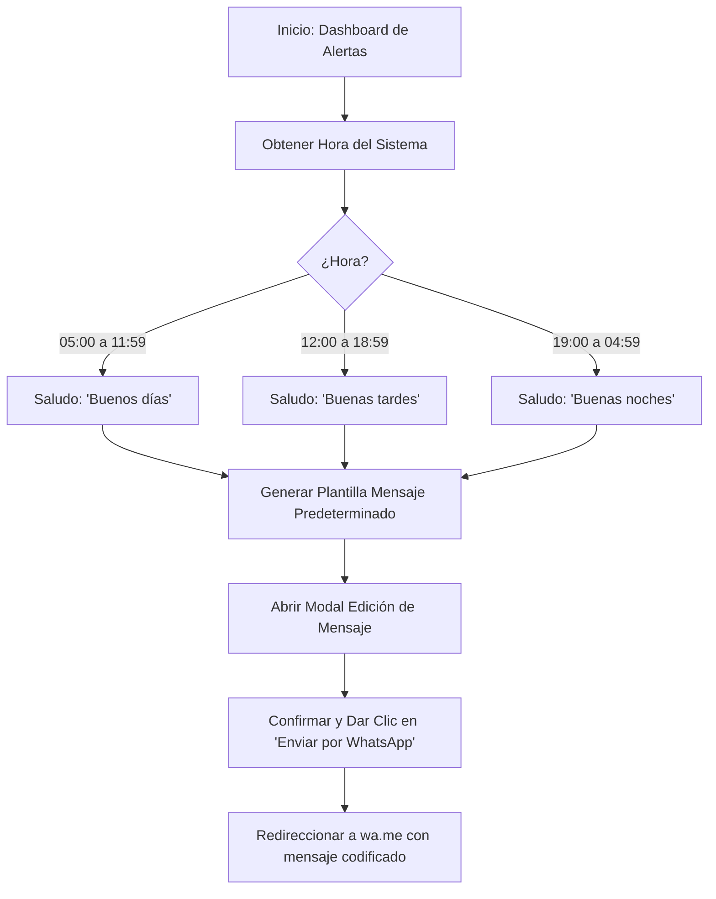
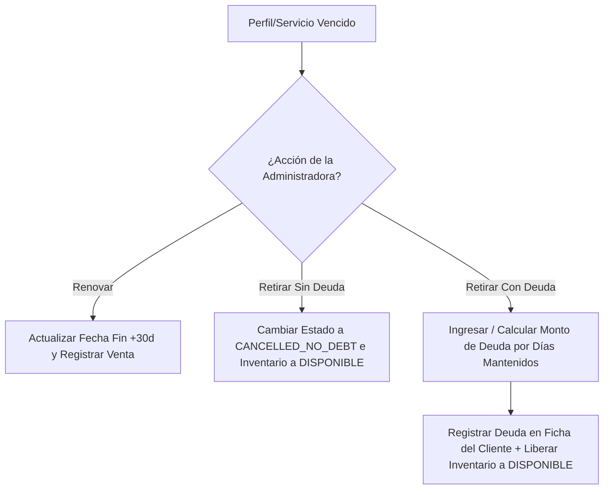

# 06 - Flujos de Negocio de Streamcell

---

## Flujo 1: Notificación de Vencimiento por WhatsApp

---

## Flujo 2: Retiro de Servicio Vencido o No Pagado

---

## Flujo 3: Registro de Productos Especiales (Canva Pro / Spotify Familiar)

1. **Selección del Producto:**
   - La administradora selecciona el tipo `PERSONAL_INVITATION`.
2. **Carga de Datos de Invitación:**
   - Si es **Canva Pro:** Ingresa el correo personal del cliente.
   - Si es **Spotify Familiar:** Ingresa el username/correo de la cuenta y la **Dirección del Grupo Familiar** (ej. "Cra 23 67-09").
3. **Guardado y Asignación:**
   - Se guarda el servicio asignado al cliente con sus fechas de corte e inicio correspondientes.
